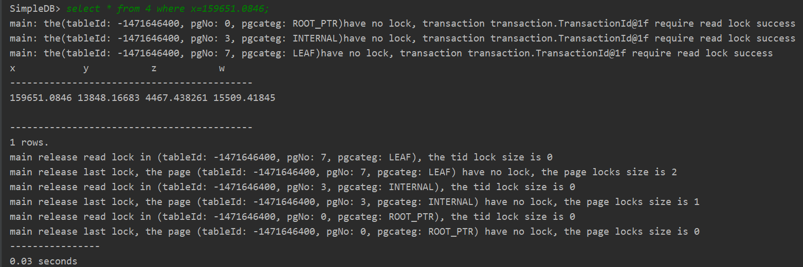
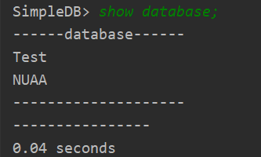

# 微型数据存储和查询系统实现

## 实现功能

采用java语言编写，开发工具使用idea，meaven进行依赖管理，使用junit进行部分单元测试。

每个表的结构是确定的，共4列，列名分别为x、y、z、w，数据类型都为double。

1. 支持的sql语句：
   * `use databaseName; `  选择数据库。
   * `create database databaseName;`  创建名为databaseName的数据库。
   * `drop database databaseName;`   删除名为databaseName的数据库。
   * `show database;`  显示所有数据库。
   * `show table;`  显示当前数据库下所有的表。
   * `create table tableName;`  创建名为tableName的表。
   * `drop table tableName; `  删除名为tableName的表。
   * `insert into tableName values(v1,v2,v3,v4); ` 向表名为tableName的表插入一条记录。
   * `delete from tableName where x > 1;`  删除表名为tableName的表中满足条件的所有记录，条件支持 >、< 、=。
   * `select * from tableName where x > 1;`  简单查询：查询表名为tableName的表中满足条件的所有记录，条件支持 >、< 、=。
   * `select * from 4 where x=[0.1,0.3],y=[0.2,0.4],z=[0.3,0.6],w=[0.2,0.3]; ` 窗口查询：查询符合具体闭区间条件的记录。

2. 实现从csv文件读取数据到数据库，并对缺失值进行补全。

3. 实现索引查找以及事务功能。

## 设计方法

1. 存储及索引设计

   采用B+树作为索引和存储，B+树的内部节点存储索引，叶子节点进行数据存储。本系统默认使用第一列值（即x）作为索引。

   对数据进行查询时，先查询找到对应的叶子节点，再找到叶子节点中相应的记录。

   每张表对应一个BTreeFile，每个BTreeFile对应磁盘上一个二进制文件，BTreeFile里面包含四种页面：

   * BTreeHeaderPage：BTreeHeaderPage之间通过指针连接起来，记录BTreeFile正在使用的页面。
   * BTreeInternalPage：BTreeInternalPage是B+树的内部节点，存储索引值。
   * BTreeLeafPage：BTreeLeafPage是B+树的叶节点，存储表中的记录。

   * BTreeRootPtrPage：在每个 BTreeFile 的开头都有一个BTreeRootPtrPage，它指向B+树的根页面（可能是BTreeInternalPage，也可能是BTreeLeafPage）和第一个BTreeHeaderPage。

   每条记录为4个double类型的值：

   ```java
   Type[] types = new Type[]{Type.DOUBLE_TYPE,Type.DOUBLE_TYPE,Type.DOUBLE_TYPE,Type.DOUBLE_TYPE};
   String[] names = new String[]{"x","y","z","w"};
   TupleDesc t = new TupleDesc(types,names);
   ```

2. B+树中查找

   根据相应条件，从B+树根节点开始查找相应的叶节点：

   ```java
   private BTreeLeafPage findLeafPage(TransactionId tid, Map<PageId, Page> dirtypages, BTreePageId pid, Permissions perm,
                                         Field f)
               throws DbException, TransactionAbortedException {
      // 如果f为null,那么直接找到内部节点的最左侧孩子节点指针进行遍历
      if (null == f) {
         if (pid.pgcateg() == BTreePageId.LEAF) {
            return (BTreeLeafPage) getPage(tid, dirtypages, pid, perm);
         }
         BTreeInternalPage page = (BTreeInternalPage) getPage(tid, dirtypages, pid, perm);
         BTreePageId childId = page.iterator().next().getLeftChild();
         return findLeafPage(tid, dirtypages, childId, perm, f);
      }
   
      //1.获取数据页类型
      int type = pid.pgcateg();
      //2.如果是leaf page，递归结束，说明找到了
      if (type == BTreePageId.LEAF) {
         return (BTreeLeafPage)getPage(tid, dirtypages, pid, perm);
      }
      //3.读取internal page要使用READ_ONLY perm
      BTreeInternalPage internalPage = (BTreeInternalPage)getPage(tid, dirtypages, pid, Permissions.READ_ONLY);
      //4.获取该页面的entries
      Iterator<BTreeEntry> it = internalPage.iterator();
      //这里需要把entry声明在循环外，如果找到最后一个entry还没找到，返回最后一个entry的右孩子
      BTreeEntry entry = null;
      while (it.hasNext()) {
         entry = it.next();
         Field key = entry.getKey();
         if (key.compare(Op.GREATER_THAN_OR_EQ, f)) {
            return findLeafPage(tid, dirtypages, entry.getLeftChild(), perm, f);
         }
      }
      return findLeafPage(tid, dirtypages, entry.getRightChild(), perm, f);
   }
   ```

3. B+树中插入

   先查找到被插入的叶节点，进行插入，如果节点内元素数超过最大值，需要实现叶节点和内部节点的分裂：

   ```java
   public BTreeLeafPage splitLeafPage(TransactionId tid, Map<PageId, Page> dirtypages, BTreeLeafPage page, Field field)
         throws DbException, IOException, TransactionAbortedException {
      // 获取叶子节点元组的数量
      int numTuples = page.getNumTuples();
      // 获取一个空的叶子页
      BTreeLeafPage rightPage = ((BTreeLeafPage) getEmptyPage(tid, dirtypages, BTreePageId.LEAF));
      // 分裂,将原始叶子页中的一半元素拷贝到空的叶子页中
      Iterator<Tuple> iterator = page.iterator();
      int num = numTuples / 2;
      // 先遍历一半元素
      while (num > 0) {
         iterator.next();
         num--;
      }
      // 然后遍历剩余的元组，插入到新的叶子页中，并记录要插入父节点的key
      Field key = null;
      while (iterator.hasNext()) {
         Tuple tuple = iterator.next();
         // 新页面的第一个元组的key为复制到父节点的key
         if (key == null) {
            key = tuple.getField(page.keyField);
         }
         // 从原始的叶子页中删除元组
         page.deleteTuple(tuple);
         // 向新页中插入元组
         rightPage.insertTuple(tuple);
      }
   
      // 更新兄弟指针
      BTreePageId rightSiblingId = page.getRightSiblingId();
      if (rightSiblingId != null) {
         BTreeLeafPage rightSibling = ((BTreeLeafPage) getPage(tid, dirtypages, rightSiblingId, Permissions.READ_WRITE));
         rightSibling.setLeftSiblingId(rightPage.getId());
         rightPage.setRightSiblingId(rightSiblingId);
         dirtypages.put(rightSiblingId, rightSibling);
      }
      rightPage.setLeftSiblingId(page.getId());
      page.setRightSiblingId(rightPage.getId());
   
      // 将脏页记录到dirtypages中
      dirtypages.put(page.getId(), page);
      dirtypages.put(rightPage.getId(), rightPage);
   
      // 向父节点插入新的entry
      BTreeEntry entry = new BTreeEntry(key, page.getId(), rightPage.getId());
      BTreeInternalPage parent = getParentWithEmptySlots(tid, dirtypages, page.getParentId(), key);
      parent.insertEntry(entry);
      dirtypages.put(parent.getId(), parent);
   
      // 由于父页面的变更，更新原始页和新页的父指针
      updateParentPointer(tid, dirtypages, parent.getId(), page.getId());
      updateParentPointer(tid, dirtypages, parent.getId(), rightPage.getId());
   
      // 判断待插入的key属于哪个叶子页
      if (field.compare(Op.LESS_THAN_OR_EQ, key)) {
         return page;
      } else {
         return rightPage;
      }
   }
   ```

   ```java
   public BTreeInternalPage splitInternalPage(TransactionId tid, Map<PageId, Page> dirtypages,
         BTreeInternalPage page, Field field)
               throws DbException, IOException, TransactionAbortedException {
   
      // 记录page中entry的数量
      int numEntries = page.getNumEntries();
      // 创建新的BTreeInternalPage
      BTreeInternalPage internalPage = (BTreeInternalPage) getEmptyPage(tid, dirtypages, BTreePageId.INTERNAL);
   
      Iterator<BTreeEntry> iterator = page.reverseIterator();
      // 将原始页中的一半元素移动到新的内部节点页中
      int num = numEntries / 2;
      while (num > 0) {
         BTreeEntry entry = iterator.next();
         page.deleteKeyAndRightChild(entry);
         internalPage.insertEntry(entry);
         num--;
      }
   
      // 推到父节点的entry
      BTreeEntry pushEntry = iterator.next();
      page.deleteKeyAndRightChild(pushEntry);
   
      // 记录脏页
      dirtypages.put(page.getId(), page);
      dirtypages.put(internalPage.getId(), internalPage);
   
      // 更新孩子指针
      pushEntry.setLeftChild(page.getId());
      pushEntry.setRightChild(internalPage.getId());
   
      // 由于页间元素的移动，更新这些页中元素的孩子指针
      updateParentPointers(tid, dirtypages, page);
      updateParentPointers(tid, dirtypages, internalPage);
   
      // 父节点，getParentWithEmptySlots会递归地调用splitInternalPage方法
      BTreeInternalPage parent = getParentWithEmptySlots(tid, dirtypages, page.getParentId(), pushEntry.getKey());
      parent.insertEntry(pushEntry);
      dirtypages.put(parent.getId(), parent);
      updateParentPointers(tid, dirtypages, parent);
   
      // 返回entry插入的BTreeInternalPage
      if (field.compare(Op.LESS_THAN, pushEntry.getKey())) {
         return page;
      } else {
         return internalPage;
      }
   }
   ```

4. B+树中删除

   先查找到需要删除的记录，删除后需要对B+树进行调整以符合B+树的性质。

5. sql语句简单解析

   Praser类：使用正则表达式提取命令第一个单词，识别命令后进行相应分配处理。

6. 事务管理

   对Bufferpool中的页面进行加锁，锁的类型为共享锁（读锁）和排他锁（写锁）。

   当事务申请锁时，思路如下：

   

7. 缺失值补全

   将csv转换成数据库中的表时，对csv中的缺失值采用平均值插补法进行补全，补全具体思路如下：

   ```java
   public static Double[] meanCompletion(String[] data){
       
       HashMap<Integer,Double> nonNullValues = new HashMap<>(4);
       ArrayList<Integer> emptyNum = new ArrayList<>();
       Double[] values = new Double[4];
   
   
       for (int i = 0; i < 4; i++) {
           String s = data[i];
           if (s != null && !s.isEmpty()){
               nonNullValues.put(i,new Double(s));
           }else {
               emptyNum.add(i);
           }
       }
   
       //没空
       if (emptyNum.size() == 0){
           for (int i = 0; i < 4; i++) {
               values[i] = new Double(data[i]);
           }
       }
   
       //缺一个值
       else if (emptyNum.size() == 1){
           double sum = 0;
           for (Integer index : nonNullValues.keySet()) {
               values[index] = nonNullValues.get(index);
               sum += values[index];
           }
           values[emptyNum.get(0)] = sum/3.0;
       }
   
       //缺两个值
       else if (emptyNum.size() == 2){
           double sum = 0;
           for (Integer index : nonNullValues.keySet()) {
               values[index] = nonNullValues.get(index);
               sum += values[index];
           }
           values[emptyNum.get(0)] = sum/2.0;
           values[emptyNum.get(1)] = sum/2.0 + 1;
       }
   
       //缺三个值
       else if (emptyNum.size() == 3){
           double sum = 0;
           for (Integer index : nonNullValues.keySet()) {
               values[index] = nonNullValues.get(index);
               sum += values[index];
           }
           values[emptyNum.get(0)] = sum;
           values[emptyNum.get(1)] = sum + 1;
           values[emptyNum.get(2)] = sum + 2;
       }
   
       return values;
   }
   ```

## 说明和分析

1. 所有数据库默认保存在databases文件夹下，该文件夹下有个dbCatalog.txt记录有哪些数据库。

   每个数据库对应一个文件夹，并且文件夹下有个catalog.txt记录该数据库中有哪些表。

2. 将csv文件转换成数据库中对应的表：

   * 运行simpleDb.java后，创建数据库NUAA。

     

     

   * 创建csv文件要转换到的表。

     

     

   * 设置CsvToTable.java相应参数，运行开始转换。

     ```java
     //要转换的csv地址
     String csvPath = "E:\\南航\\数据库实验\\NCAA2022\\4.csv";
     
     //设置数据库
     Utility.setNowPath("NUAA");
     Database.getCatalog().loadSchema(Utility.getNowPath() + "\\catalog.txt");
     
     //设置被插入的表
     String tableName = "4";
     ```

   * 转换结果：

     
     
     

3. 查找

   说明：此处对比时间需要每次重新运行系统，否则buferpool中有缓存，可能不需要进行读磁盘，对时间影响比较大。

   * 对同一条记录，采用索引查找和非索引查找对比：

     | x           | y           | z           | w           |
     | ----------- | ----------- | ----------- | :---------- |
     | 159651.0846 | 13848.16683 | 4467.438261 | 15509.41845 |

     * 索引查找：

       

       

     * 非索引查找：

       

       

       

       
       
       

     可以看到使用索引查找比非索引查找快了0.3s。

   * 窗口查询

     

     

     

     

     

     
     
     
     
     分析：扩大窗口查询时间变化不大，原因是窗口查询在实现时是进行了八次筛选，比如上面的语句，先根据索引x筛选x>=0的所有记录，再依次进行其他条件筛选，所以主要耗时在第一次筛选从磁盘读，造成两次时间相差不大。

4. 其他功能演示

   * 创建数据库

     

     

   * 显示数据库

     

     

   * 选择数据库

     

     

   * 创建表

     

     

   * 显示指定数据库中的表

     

     

   * 向表中插入数据

     

     

   * 从表中删除数据
   
     
   
     
   
   * 删除表
   
     
   
     
   
   * 删除数据库
   
     
     
     
   
   
